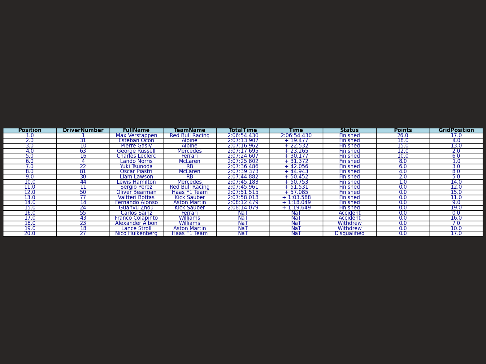

# Formula One Analysis with FastF1

## Description

Project using FastF1 with analyses from races from Formula One.

---

## How to Run

Please ensure you have Python 3.7 or higher installed before running this project. You can verify your Python version by running:
```bash
python --version
```
If you're using macOS or Linux, you might need to use `python3` instead of `python`. 

If you want to run this project in a virtual environment, I recommend you create and activate it by running the following commands:

### Windows
```cmd
python -m venv venv
venv\Scripts\activate
```

### macOS / Linux
```bash
python3 -m venv venv
source venv/bin/activate
```

After activating the virtual environment, install the required dependencies:
```bash
pip install -r requirements.txt
```

To run the project in a Jupyter Notebook:
1. Start Jupyter Notebook:
   ```bash
   jupyter notebook
   ```
2. Open the notebook file (.ipynb) in the Jupyter interface.

To deactivate the virtual environment when you're done:
```bash
deactivate
```

---

## Running Race Results Example

### Using notebook runscripts
1. Open the notebook runscripts.ipynb
2. Execute the command
```bash
%run race_results.py year=2024 weekend='Brazil' session='R' export_excel='True' excel_file_name='results_race_excel'
```
The following parameters are necessary:
   - year;
   - weekend;
   - session:
      
      - 'R' for Races
      - 'Q' for Qualifying
      - 'S' for Sprint
      - 'SQ' for Sprint Qualifying

If you desire to export in excel or csv, you can use the following parameters:
   For excel:
      export_excel='True'
      excel_file_name='WRITE_YOUR_DESIRED_FILE_NAME'
   For csv:
      export_csv='True'
      csv_file_name='WRITE_YOUR_DESIRED_FILE_NAME' 

In the example, the script is getting data from 2024 São Paulo Grand Prix and saving a file named results_race_excel.xlsx. And it's going to plot the data in the following image:



---

## Notice

This project is unofficial and is not associated in any way with the Formula 1 companies. F1, FORMULA ONE, FORMULA 1, FIA FORMULA ONE WORLD CHAMPIONSHIP, GRAND PRIX and related marks are trade marks of Formula One Licensing B.V.
